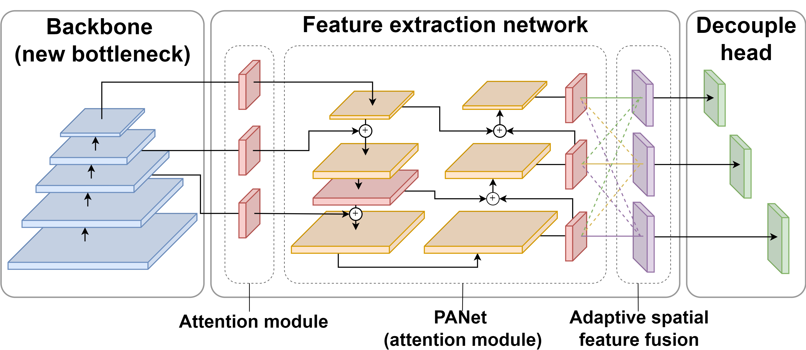
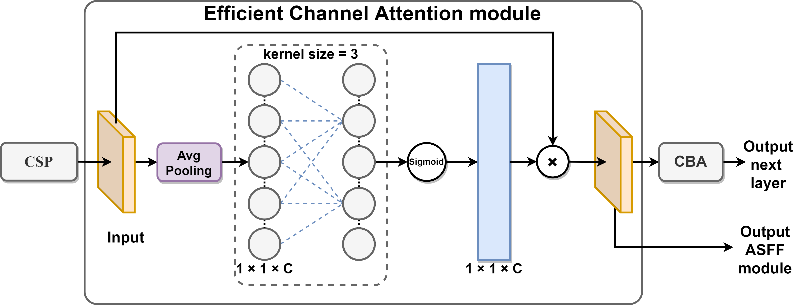
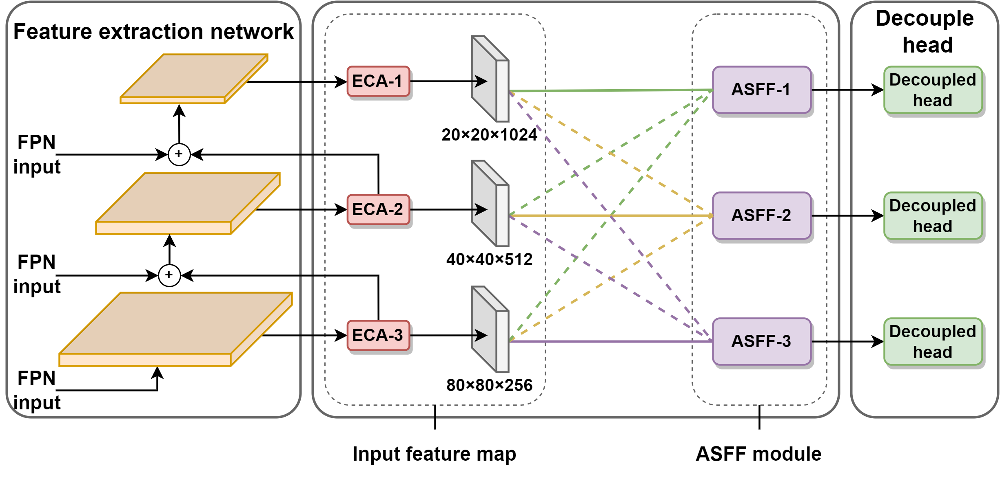
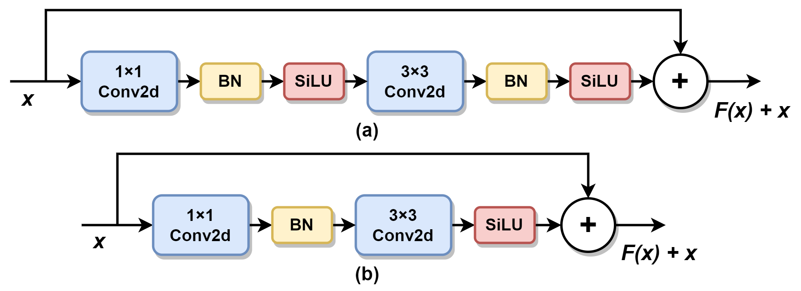

# NRSD-MN-relabel Readme
This is the README of the NRSD-MN relabeled dataset.

We are pleased to announce that our paper has been published, titled "AMFF-YOLOX: Towards an Attention Mechanism and Multiple Feature Fusion Based on YOLOX for Industrial Defect Detection"，with the link [https://www.mdpi.com/2079-9292/12/7/1662](https://www.mdpi.com/2079-9292/12/7/1662) or [pdf](./paper/) version.

Click the datasets [url](https://drive.google.com/drive/folders/13r-l_OEUt63A8K-ol6jQiaKNuGdseZ7j?usp=sharing), you can get the defect dataset of NRSD-MN-relabel.

**The Overview of AMFF-YOLOX**



An overview of the detection network [ [code](./code/yolox/models/yolox.py) ]. The blue block is the backbone, the red block is the attention module, the orange block is PANet, the purple block is the adaptive spatial feature fusion, and the green is the decouple head.


An overview of the feature extraction network [ [code](./code/yolox/models/yolo_pafpn_best.py) ]. To better focus on industrial defects, this paper adds an ECA module to the back three layers of the backbone network and the output position of the CSP layer of PANet, as shown in Figure 2. Using the ECA module does not add too many parameters to the model in this study. At the same time, it assigns weighting coefficients to the correlation degree of different feature maps, so that it can play the role of strengthening the important features. In this paper, adaptive spatial feature fusion is added after PANet. It weighted and summed the three scale feature information outputs of the three layers after the feature extraction network to enhance the invariance of the feature scales.



An overview of the ECA module [ [code](./code/yolox/models/yolo_attention.py) ]. Each attention group consists of a CSP layer, an ECA module, and a base convolutional block. The CSP layer enhances the overall network’s ability to learn features, and it passes the results of feature extraction into the ECA module. The first step of the ECA module performs an averaging pooling operation on the incoming feature maps. The second step calculates the result using a 1D convolution with a kernel of 3. In the third step, the above results are applied to obtain the weights of each channel using the Sigmoid activation function. In the fourth step, the weights are multiplied with the corresponding elements of the original input feature map to obtain the final output feature map. Finally, a base convolution is used as an overload for network learning. It outputs the results to subsequent base convolution blocks or individually.



An overview of the ASFF module with attention mechanism [ [code](./code/yolox/models/yolo_asff.py) ]. he feature extraction layer in this paper by retaining the ECA module final output of three different scales of feature maps. The adaptive spatial feature fusion mechanism weights and sums the feature map information at different scales of 20 × 20, 40 × 40 and 80 × 80 for these three feature map scales, and calculates the corresponding weights.

In Equation 1, $X^{eca1\rightarrow{level}}\_{ij}$, $X^{eca2\rightarrow{level}}\_{ij}$, $X^{eca3\rightarrow{level}}\_{ij}$ represent the feature information from PANet's three attention mechanisms (ECA-1, ECA-2 and ECA-3), respectively. We multiply the above feature information with the weight parameters $\alpha^{level}\_{ij}$, $\beta^{level}\_{ij}$ and $\gamma^{level}\_{ij}$ (i.e., the feature vector shared by $\alpha$, $\beta$, $\gamma$ at position $(i, j)$ among channels), adjust them to the same size of the feature map and then add them together to get a new fusion layer.

$$(1)\    y^{level}\_{ij} = \alpha^{level}\_{ij} \cdot X^{eca1\rightarrow{level}}\_{ij} + \beta^{level}\_{ij} \cdot X^{eca2\rightarrow{level}}\_{ij} + \gamma^{level}\_{ij} \cdot X^{eca3\rightarrow{level}}\_{ij}$$

In Equation 2, $\alpha^{level}\_{ij}$, $\beta^{level}\_{ij}$ and $\gamma^{level}\_{ij}$ are defined by the softmax function as parameters with sum 1 and range belonging to [0,1] in Equation 3. Equation 4 is the calculation of each weight parameter, where $\lambda^{level}\_{\alpha}$, $\lambda^{level}\_{\beta}$ and $\lambda^{level}\_{\gamma}$ are calculated by convolution in $X^{eca1\rightarrow{level}}$, $X^{eca2\rightarrow{level}}$, $X^{eca3\rightarrow{level}}$, and $\theta$ is the set of weight parameters $\alpha$, $\beta$ and $\gamma$.

$$(2)\    \alpha^{level}\_{ij} + \beta^{level}\_{ij} + \gamma^{level}\_{ij} = 1 $$

$$(3)\    \alpha^{level}\_{ij}, \beta^{level}\_{ij}, \gamma^{level}\_{ij} \in [0, 1] $$

$$(4)\    \theta^{level}\_{ij} = \frac{e^{\lambda^{level}\_{\theta_{ij}}}}{e^{\lambda^{level}\_{\alpha_{ij}}} + e^{\lambda^{level}\_{\beta_{ij}}} + e^{\lambda^{level}\_{\gamma_{ij}}}}, \theta \in [\alpha, \beta, \gamma] $$



The bottleneck design structure improvement [ [code](./code/yolox/models/network_blocks.py#L63) ]. Based on the CSP-Darknet model, this paper refers to the bottleneck design pattern of ConvNeXt. A SiLU activation function is removed after the 1 × 1 convolution of the model, and a normalization function is removed after the 3 × 3 convolution, as shown in Figure 5.

**Result in Public Datasets**


The NRSD-MN dataset results. (a) Ground truth of the dataset. (b) Baseline prediction
label. (c) Model prediction label of this paper.


The NEU-DET dataset results. (a) Ground truth of the dataset. (b) Baseline prediction label.
(c) Model prediction label of this paper.


The PCB dataset results. (a) Ground truth of the dataset. (b) Baseline prediction label.
(c) Model prediction label of this paper.

**License**

We thank the authors of the paper for licensing the NRSD dataset to us.


**Datasets URL**：[https://drive.google.com/drive/folders/13r-l_OEUt63A8K-ol6jQiaKNuGdseZ7j?usp=sharing](https://drive.google.com/drive/folders/13r-l_OEUt63A8K-ol6jQiaKNuGdseZ7j?usp=sharing) and [https://huggingface.co/datasets/chairc/NRSD-MN-relabel](https://huggingface.co/datasets/chairc/NRSD-MN-relabel)

**Datasets Paper**: Chen Y, Tang Y, Hao H, et al. AMFF-YOLOX: Towards an Attention Mechanism and Multiple Feature Fusion Based on YOLOX for Industrial Defect Detection[J]. *Electronics*, 2023, 12(7): 1662.

Dataset Original Repository: [MCnet](https://github.com/zdfcvsn/MCnet)

Dataset Original Paper: Zhang D, Song K, Xu J, et al. MCnet: Multiple context information segmentation network of no-service rail surface defects[J]. *IEEE Transactions on Instrumentation and Measurement*, 2020, 70: 1-9.

If you want to cite this.
```
@Article{electronics12071662,
author = {Chen, Yu and Tang, Yongwei and Hao, Huijuan and Zhou, Jun and Yuan, Huimiao and Zhang, Yu and Zhao, Yuanyuan},
title = {AMFF-YOLOX: Towards an Attention Mechanism and Multiple Feature Fusion Based on YOLOX for Industrial Defect Detection},
journal = {Electronics},
volumn = {12},
year = {2023},
number = {7},
article-number = {1662},
url = {https://www.mdpi.com/2079-9292/12/7/1662},
issn = {2079-9292},
doi = {10.3390/electronics12071662}
}
```

and

```
@Article{9285332,
  author = {Zhang, Defu and Song, Kechen and Xu, Jing and He, Yu and Niu, Menghui and Yan, Yunhui},
  journal = {IEEE Transactions on Instrumentation and Measurement}, 
  title = {MCnet: Multiple Context Information Segmentation Network of No-Service Rail Surface Defects}, 
  year = {2021},
  volume = {70},
  number = {},
  pages = {1-9},
  doi = {10.1109/TIM.2020.3040890}}

```

